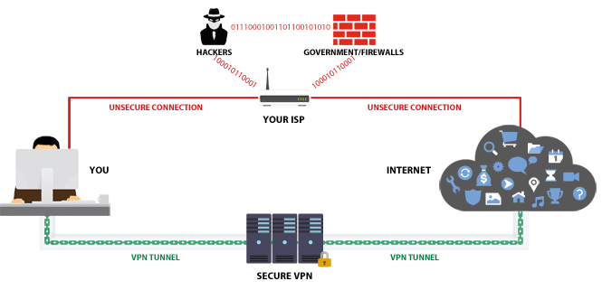
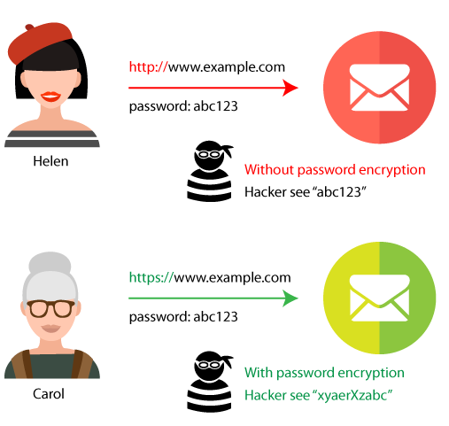
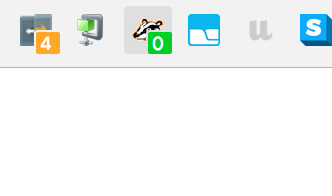
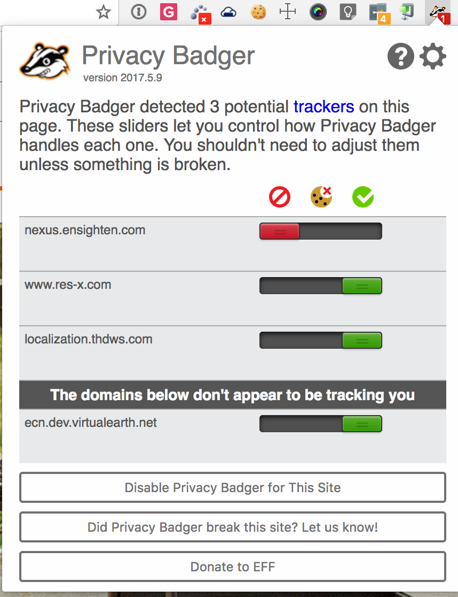

# Smoke Bomb
Steps to prevent sites, cell phone providers, and internet service providers(ISP) from tracking what you do.

## Brief education

### Why should I even care?
The House of Representatives followed the Senate in voting for a resolution that throws out Obama-era regulations that would have banned your internet service provider from selling your web browsing history to advertisers. So what does that mean?

- It puts you at risk
  - With location data, browsing data, and other information at their fingertips, hackers could easily breach your passwords, fill your Facebook wall with spam, and otherwise make your life miserable, even if you do everything right, just because a third party bought your data and left it sitting around on the internet.
- You can't opt out
  - If you want to opt out, your choice is to either be on the internet or not. That is unacceptable! The fact that you're forking over your data should be part and parcel of everyday life so these companies can treat it like they have every right to profit off of it (almost certainly without ever reducing their prices).

Great resource about internet freedom and how to protect it/yourself [EFF](https://www.eff.org/)

### Using the internet without VPN vs using VPN

### Visting websites using HTTP vs HTTPS
**Super short version:** HTTP vs HTTPS, the "S" in HTTPS stands for secure. When you use websites with only HTTP, your internet service provider(ISP) or cell phone network can see what site you visited and all the things you did on that site. When you use websites with HTTPS, your ISP or cell phone network can see what site you visted but not what you do or the content being viewed. Unfortuantly, not every website has HTTPS enabled on their website but it's becoming more common.

#### What HTTPS looks like in different browsers

#### HTTP vs HTTPS

## Should I install a VPN on my router or use a VPN software?
This is up to you. The reason most people say it's better to have a VPN installed on your router is so you don't forget to tunnel into your VPN software. My argument against that is you have to use a VPN software outside your home to stay protected.  So might as well have one solution, make it a habit, and don't have to buy a second router and install a VPN on it.

## Protecting yourself everywhere you go
There is a ton of VPN softwares out there but they vary in features.
- [VyprVPN](https://www.goldenfrog.com/vyprvpn/buy-vpn) - The best VPN for performance and security. Sign up fo the premium account that for the first year is discounted($60 for the first year, $80 after). This is the one I'm going to be trying.
- [IPVanish](https://www.ipvanish.com/top-vpn-service/) - The best VPN for torrenting and other P2P traffic but more expensive than others.
- [ExpressVPN](https://www.expressvpn.com/) - The best offshore VPN for privacy and unblocking but more expensive than others.

## Protect your home networks
If you still want to buy 2 routers and install a VPN on your home network, then here is a [tutorial]( http://troypoint.com/install-vpn-router/). 

## Protection against site tracking
- Stop using Internet Explorer PLEASE!
- I started using the browser [Brave](https://brave.com/) because it already blocks ads and enables the [HTTPS Everywhere](https://www.eff.org/https-everywhere). You'll have faster web page speed loads, especially on mobile devices because of all the ad tracking it blocks. Also, it's built off of Chrome so it acts/performs roughly the same.
- OR if you're not ready to give up your favorite browser(excluding IE), this can be solved 
- All browser plugins are usually for Chrome, Firefox, or Opera.
- To block spying ads and invisible trackers - Download [Privacy Badger](https://www.eff.org/privacybadger)
- Encrypt your communications with many major websites, making your browsing more secure - Download [HTTPS Everywhere](https://www.eff.org/https-everywhere)
- Goolge and Bing track your searching. If that bothers you, use [Duck Duck Go](https://duckduckgo.com/)

## Hide yourself from cell phone companies
- Use a [VPN app](#software-vpn)
- Use [Brave](https://brave.com/) for browsering
- Get Signal SMS app(Edward Snowden recommended) and use it as your default SMS app. This will encrypt all SMS messages from your cell phone provider [iOS](https://itunes.apple.com/us/app/signal-private-messenger/id874139669?mt=8) | [Android](https://play.google.com/store/apps/details?id=org.thoughtcrime.securesms&hl=en)

## Help! Common issues
- My favorite website isn't working now after you told me to install all this crap!
  - This could be that Privacy Badger is preventing the website from downloading files that it saw as possibly site tracking. Try adjusting the settings on Privacy Badger. If it's red, it's blocking something that might prevent the website from working. 

## Got questions or suggestions?
Please submit a [ticket](https://github.com/creatifyme/smoke-bomb/issues/new).
